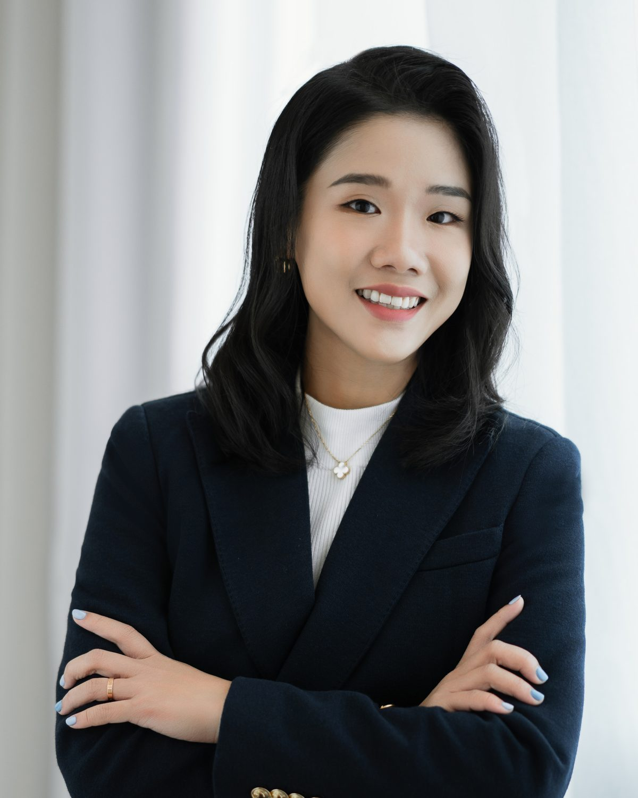

# Assets needed

The page renders and reads correctly as it stands. One real asset would lift it
considerably, and it is deliberately not faked.

---

## 1. Portrait of Carine (needed)

| | |
|---|---|
| **Path** | `assets/img/carine.jpg` |
| **Crop** | Portrait, 4:5 |
| **Size** | 800 x 1000 minimum, 1200 x 1500 preferred |
| **Where** | Hero, right column |

Currently a styled placeholder frame, not a broken image, so the layout looks
finished while you wait for the file.

### Swapping it in

In `index.html`, replace this block:

```html
<div class="portrait__slot">
  <strong>Portrait of Carine</strong>
  Add as assets/img/carine.jpg, portrait crop, 4:5, 800&times;1000 or larger.
</div>
```

with:

```html

```

The frame styling is shared between the two, so nothing else changes. The
`width`/`height` attributes are there to hold layout and keep CLS at zero.

### A note on sourcing it

There is a headshot on her Financial Alliance profile
(`engage.fa.com.sg/wp-content/uploads/jet-engine-forms/250/2023/07/myself.jpg`).
It was **not** copied into this project. It sits on her employer's CDN, it is
low resolution for a hero slot, and its licensing for use outside FAPL's own
site is unclear. Ask Carine for the original file, or commission a new one.

**Do not substitute a stock photo or an AI-generated face.** This is a real,
licensed person. The portrait has to be her.

---

## 2. Social share image (optional)

| | |
|---|---|
| **Path** | `assets/img/og.jpg` |
| **Size** | 1200 x 630 |
| **Where** | `og:image` / `twitter:image` meta tags |

The Open Graph tags are in place but carry no image, so links currently unfurl
as text only. Add the file, then add to `<head>`:

```html
<meta property="og:image" content="assets/img/og.jpg">
<meta name="twitter:image" content="assets/img/og.jpg">
```

Also set `og:url` to the real domain once hosting is decided.

---

## 3. Favicon (optional)

`favicon.svg` plus `apple-touch-icon.png` at 180 x 180. A monogram in EB
Garamond on the forest green (`#1e4635`) would match the page.

---

## Already handled

- **Fonts.** EB Garamond and Instrument Sans are self-hosted in
  `assets/fonts/` as latin-subset variable woff2, about 122KB total. No requests
  leave the page, so nothing breaks offline or behind a corporate proxy.
- **Icons.** None used. Contact details are set typographically, so there is no
  icon library to license or maintain.
